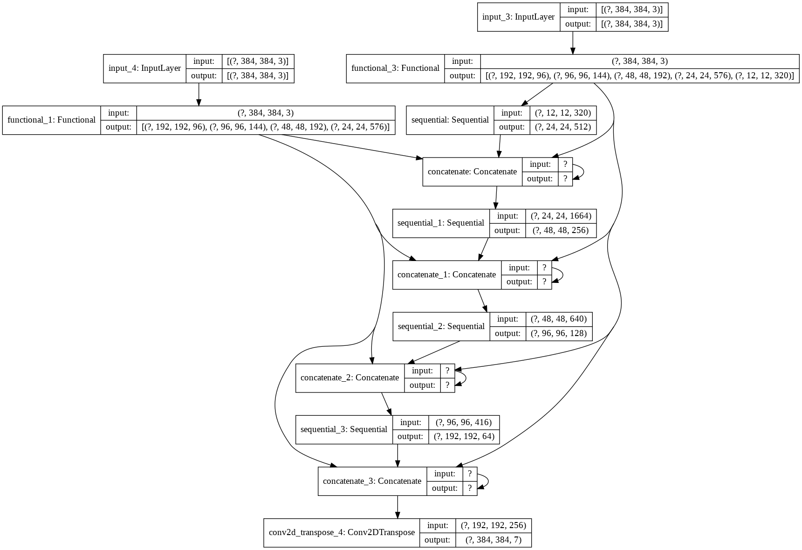

# rgbd_net
experiment to find out if depth data adds value in terms of accuracy to the output of a semantic segmentation convolution neural network
--Work in progress

# Architecture
  Dual Input U-Net-like architecture 
Encoder: MobileNetV2 
Decoder: Tensorflow Pix2Pix</image>

## Input
Takes in an RGB Image as well as the corresponding depth image. The single channel depth image is converted to a 3 channel image. Subsequently the depth and RGB images are decoded separately. At certain points when the image is downscaled via the MobilenetV2 layers, the outputs from the downscaling are taken and concatenated with the upscaled image of the decoder of similar shape.

## Output
A Semantically Segmented Image

## Demo
demo with rgb-only data. run segmgment_video.py

## Results
--work in progress